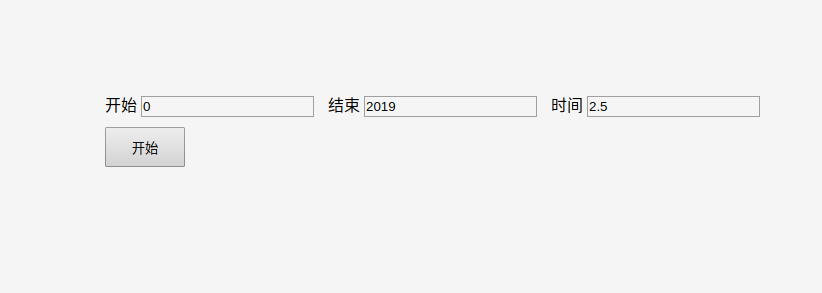

# kcounter

> A Vue.js component

## Build Setup

``` bash
# install dependencies in the project
npm install kcounter
```

## Introduce in the entry file (main.js)

```js
import Vue from 'vue'
import App from './App.vue'
import kcounter from 'kcounter'

Vue.use(kcounter)

new Vue({
  el: '#app',
  render: h => h(App)
})
```

## Example

```vue
<template>
  <div id="app">
    <kcounter :autoplay="false"/>
  </div>
</template>

<script>
export default {
  name: 'app',
  data () {
    return {
     
    }
  }
}
</script>
```
#### Params

autoplay: if auto play the counter when default

start: start num

end: end time

duration: Maintenance time


